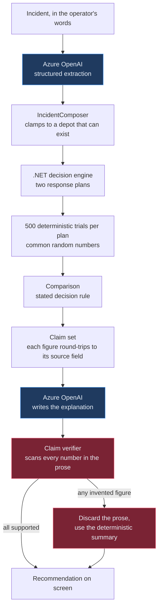

# Forkcast

**See both futures before you decide.**

An AI decision agent for operational incidents. A manager describes what broke; Forkcast extracts
the constraints, builds two response strategies, simulates the consequences of each, verifies
every number it is about to show, and recommends one.

> **The model can write the explanation. It is never allowed to invent the numbers.**

| | |
|---|---|
| **Team** | Forkcast |
| **Members** | _(solo — add teammates here)_ |
| **Primary category** | Best AI Agent or Workflow Automation |
| **Secondary category** | Best Azure OpenAI / LLM-Powered App |
| **Demo video** | [`./demo/demo.mp4`](./demo/demo.mp4) |
| **Stack** | ASP.NET Core Minimal API · C# · Azure OpenAI · React + TypeScript + Vite · deterministic Monte Carlo · xUnit |

---

## The problem

When something breaks on an operational site, the hard part is rarely *what happened*. It is
**which response to take, in the next ten minutes, with incomplete information**.

Managers do this with a whiteboard and a gut feeling, because the alternative — modelling both
options properly — takes longer than the window they have. And the obvious modern answer, "ask a
language model", fails in the one way that matters: a model will confidently produce
`87% on-time` and `£4,200 saved`, and those figures come from nowhere. A wrong number that reads
fluently is worse than no number at all, because someone acts on it.

## What Forkcast does

Forkcast splits the problem along the line where each tool is actually good.

1. **Reads the incident.** Free text becomes a structured incident: fleet, connectors, deadline,
   battery range, what failed.
2. **Builds two response plans.** A do-nothing baseline and an intervention.
3. **Simulates both.** 500 seeded Monte Carlo trials per plan, over connector occupancy, manual
   re-plug delays, static load management, and a towed battery unit.
4. **Verifies every claim.** Each figure must round-trip to the simulation field it came from.
   Generated prose is scanned, and discarded whole if it contains a number no claim supports.
5. **Recommends**, under a stated rule, with the evidence attached.
6. **Lets you challenge it.** Change an assumption and the simulation genuinely reruns.

### The demo incident

At 18:40 the fast charger at an electric delivery depot fails. Twenty vehicles must depart by
06:00, eight AC charge points remain, and six routes are priority.

| | Continue current schedule | Reprioritise + battery buffer |
|---|---|---|
| On-time departures | **60.9%** | **97.2%** |
| Vehicles at risk | 9 of 20 | 1 of 20 |
| Unmet energy at departure | 413.1 kWh | 2.2 kWh |
| Intervention cost | £0 | £379 |
| Operational risk | High | Low |

**Recommended:** reprioritise priority-route vehicles and activate the temporary battery buffer.
**8 verified claims · 0 unsupported numbers · seed 20260728.**

Ask *"what happens if the temporary battery arrives one hour late?"* and the simulation reruns:
on-time departures fall **97.2% → 86.7%**, vehicles at risk go **1 → 8**, and residual risk moves
from Low to High. Those numbers appear nowhere in the frontend — they come back from the engine.

The fleet is the demonstration, not the product. The same structure — constrained resource, hard
deadline, competing responses — is a factory line, a supply chain, a datacentre cooling loop.

---

## Why you can trust the numbers

This is the part worth reviewing.



**The model may** read a report into a fixed schema · name and describe a plan · write the
executive explanation · classify which assumption a question is challenging.

**The model may not** produce a percentage, a cost or a vehicle count · decide which plan wins ·
state a figure no claim supports · be on the critical path.

Four mechanisms enforce that.

**Claims, not values.** Every displayed figure is a `Claim` carrying its source field
(`alternative.onTimeDeparturePct`), how it was calculated, the seed and the trial count. A claim
is `Verified` only if its value still round-trips through `ClaimSetBuilder.Resolve` to the
simulation output it names. Edit a value and verification fails.

**Rejection, not correction.** `ClaimVerifier` masks identifiers and clock times, then checks
every remaining number in the generated prose against the claim set and a short allow-list of
incident facts. One unsupported figure discards the *whole* paragraph — a narrative that got one
number wrong is not evidence about the others.

**Common random numbers.** Both plans are evaluated against the *same* sampled nights. The gap
between them reflects the plans, not sampling noise, so a plan cannot look better by accident.

**Reproducibility.** The generator is SplitMix64, implemented in-tree rather than taken from
`System.Random`, so anyone can regenerate the published figures from seed `20260728` on any
platform. A test pins a derived seed literally, to catch that ever changing.

Watch it work: the verification panel shows `8 verified claims · 0 unsupported numbers`. If a
model ever invents a figure, that panel shows the rejected token, its context, and the fact that
the deterministic summary was substituted.

---

## Running it

Requires the [.NET 9 SDK](https://dotnet.microsoft.com/download) and [Node.js 22+](https://nodejs.org).

```bash
# terminal 1 — API on http://localhost:5199
dotnet run --project src/Forkcast.Api

# terminal 2 — interface on http://localhost:5173
cd web && npm install && npm run dev
```

Open <http://localhost:5173>. **No credentials, no database, no other services.** The badge in
the header reads *Deterministic demo mode*, and everything works.

The API also serves an interactive reference at <http://localhost:5199/scalar/v1> and its OpenAPI
document at `/openapi/v1.json`.

### Verifying the build

```bash
dotnet build          # 0 warnings — warnings are errors
dotnet test           # 131 tests
cd web && npm run build
```

### Optional: connect Azure OpenAI

```bash
cp .env.example .env   # then fill in the three values
```

```
AZURE_OPENAI_ENDPOINT=https://<resource>.openai.azure.com
AZURE_OPENAI_API_KEY=<key>
AZURE_OPENAI_DEPLOYMENT=<deployment name>
```

The API reads `.env` at startup; real environment variables take precedence. Restart it and the
badge changes to *Azure OpenAI connected*. Every simulated number stays identical — what improves
is how unusual incident wording is read and how the explanation is written.

### API

| | |
|---|---|
| `GET /api/health` | Liveness, version, which provider is answering |
| `GET /api/demo/incident` | The preloaded incident and both response plans |
| `GET /api/demo/result` | The full decision at the published seed |
| `POST /api/incidents/parse` | Incident text → structured incident |
| `POST /api/simulations/run` | Simulate both plans, return the verified recommendation |
| `POST /api/simulations/challenge` | Change one assumption, rerun, report the difference |

```bash
curl -s http://localhost:5199/api/demo/result | jq '.verification.verifiedClaims'

curl -s -X POST http://localhost:5199/api/simulations/challenge \
  -H 'Content-Type: application/json' \
  -d '{"question":"What happens if the temporary battery arrives one hour late?"}' \
  | jq -r '.delta.summary'
```

---

## Screenshots

**The incident**, editable, with its constraints read out of the text:


**Two futures**, drawn on one shared scale so the charts can be read against each other:


**The recommendation**, with the rule that chose it and the claims behind it:


**Every number, accounted for** — expand any claim for its source field and calculation:


**Challenge it** — a real rerun, not a canned answer:


Every screenshot is captured from the running application by
[`web/scripts/capture.mjs`](web/scripts/capture.mjs). None of them is a mock-up.

---

## How it is built

```
src/
  Forkcast.Core/          pure domain — no framework, no I/O
    Simulation/           SplitMix64, trial noise, the engine
    Verification/         claims, the verifier, the allow-list
    Comparison/           the decision rule
    Challenges/           the closed set of challengeable assumptions
    Ai/                   the language boundary, and its deterministic implementation
  Forkcast.Api/           Minimal API, DTO mapping, Azure OpenAI provider
tests/Forkcast.Tests/     131 tests
web/                      React + TypeScript + Vite, one page
demo/                     screenshots and the demo video
```

`Forkcast.Core` has no dependency on ASP.NET, on HTTP, or on any model. It is the part that
computes, and it can be run and tested entirely on its own.

**No** database, authentication, repository pattern, CQRS, event bus, or microservices. The
problem does not need them, and each one would be another thing between a reviewer and the logic.

### Tests worth looking at

- `Published_demo_figures_hold` — pins the numbers in this README to what the engine returns, so
  the README and the video cannot drift away from the product
- `An_invented_number_is_rejected_and_the_narrative_is_replaced`
- `One_invented_number_discards_the_whole_narrative`
- `Clock_times_and_vehicle_identifiers_are_not_treated_as_quantities`
- `Derived_seeds_do_not_depend_on_runtime_string_hashing`
- `A_failing_language_model_does_not_take_the_decision_down`
- `Failed_and_remaining_connectors_are_told_apart`

---

## Security and safety

- **No secrets in the repository.** `.env`, `appsettings.Development.json` and `secrets.json` are
  git-ignored; `.env.example` and `appsettings.Example.json` carry only empty placeholders. If a
  key is ever pushed by accident, rotate it in the Azure portal immediately — removing the commit
  is not enough.
- **The key never leaves the backend.** The browser talks only to the Forkcast API.
- **CORS is an allow-list** of the two local frontend ports. Never `AllowAnyOrigin`.
- **Input is bounded**: 4000 characters of incident text, 500 for a question, 1–2000 trials.
  Everything else is rejected with problem details.
- **No stack trace can reach the screen.** Unhandled failures are logged server-side and returned
  as a plain problem document; the frontend has a designed state for every failure, including the
  API being unreachable.
- **Model output is untrusted by construction.** Extraction is clamped by `IncidentComposer`,
  prose is checked by `ClaimVerifier`, challenge classification is constrained to a closed enum,
  and plan wording containing any digit is discarded.
- **No personal data.** The fleet is synthetic and fixed.

## Known limitations

Stated plainly, because a decision-support tool that oversells itself is the problem it claims to
solve.

- **The fleet model is simplified.** It models connector occupancy, static load management,
  re-plug delays and a towed battery. It does **not** model battery charge curves, thermal
  behaviour, cable losses, degradation or driver behaviour. It is a decision-support simulation,
  not a physical one.
- **The operational data is synthetic.** The depot, fleet, tariff and costs are plausible and
  hand-authored. They are not measurements from a real site.
- **It is not a fleet optimiser.** It compares two named strategies. It does not search for the
  best one.
- **Two plans, not N.** The comparison is deliberately head-to-head.
- **The deterministic reader is a fallback, not a peer.** Without Azure OpenAI, unusual phrasing
  may be misread. It reports what it could not find rather than guessing, and the interface shows
  those notes.
- **A real deployment would need integration** with fleet telematics, charge point management and
  the energy supplier, plus validation against measured outcomes before anyone trusted a number.
- **Human operators remain responsible.** Forkcast recommends. It does not act, and it is not
  designed to be believed without the evidence it shows alongside.

## Where this goes next

The engine is generic over "constrained resource, hard deadline, competing responses". The fleet
scenario is one configuration of it. The same core would serve a factory line with a failed
machine and a shift deadline, a distribution centre with a dock shortage, a datacentre with a
cooling loop down and a thermal ceiling, or a rail depot with a maintenance road out of service.

What carries over unchanged: the claim layer, the verifier, common random numbers, the closed set
of challengeable assumptions, and the rule that the model explains but never calculates.

## Licence

[MIT](LICENSE).
