# Forkcast

**See both futures before you decide.**

An AI decision agent for operational incidents. A manager describes what broke; Forkcast extracts
the constraints, builds two response strategies, simulates the consequences of each, verifies
every number it is about to show, and recommends one.

> **Forkcast draws a hard boundary between language and evidence. The model can explain a
> decision. It cannot invent the numbers behind it.**

That boundary is the product. Everything else here is in service of it, and you can attack it
yourself in the running app: [**write a figure it cannot support**](#try-to-fool-it) and watch the
paragraph around it get discarded.

Forkcast is not a fleet tool. It is a **decision intelligence layer for operations**: turn a
situation into alternative futures, verify every figure, and brief the room. The electric depot is
one worked example; a GPU compute hall runs on the same engine.

| | |
|---|---|
| **Team** | Forkcast |
| **Members** | _(solo — add teammates here)_ |
| **Primary category** | Best AI Agent or Workflow Automation |
| **Secondary category** | Best Azure OpenAI / LLM-Powered App |
| **Demo video** | [`./demo/demo-smooth.mp4`](./demo/demo-smooth.mp4) |
| **Stack** | ASP.NET Core Minimal API · C# · Azure OpenAI · React + TypeScript + Vite · deterministic Monte Carlo · xUnit |
| **Domains shipped** | An electric delivery depot and a GPU compute hall, on the same engine |
| **Tests** | 164, `dotnet test` |

---

## The problem

When something breaks on an operational site, the hard part is rarely *what happened*. It is
**which response to take, in the next ten minutes, with incomplete information**.

Managers do this with a whiteboard and a gut feeling, because the alternative — modelling both
options properly — takes longer than the window they have. And the obvious modern answer, "ask a
language model", fails in the one way that matters: a model will confidently produce
`87% on-time` and `£4,200 saved`, and those figures come from nowhere. A wrong number that reads
fluently is worse than no number at all, because someone acts on it.

## What Forkcast does

Forkcast splits the problem along the line where each tool is actually good.

1. **Reads the incident.** Free text becomes a structured incident: fleet, connectors, deadline,
   battery range, what failed.
2. **Builds two response plans.** A do-nothing baseline and an intervention.
3. **Simulates both.** 500 seeded Monte Carlo trials per plan, over connector occupancy, manual
   re-plug delays, static load management, and a towed battery unit.
4. **Verifies every claim.** Each figure must round-trip to the simulation field it came from.
   Generated prose is scanned, and discarded whole if it contains a number no claim supports.
5. **Recommends**, under a stated rule, with the evidence attached.
6. **Lets you challenge it.** Change an assumption and the simulation genuinely reruns.

### Two domains, one engine

Forkcast ships two incidents that share no vocabulary, no units and no failure mode. Switch
between them in the interface. Neither required a line of change in the simulation, the
comparison, the claim layer or the recommendation — the nouns are data, not code.

| | Electric delivery depot | GPU compute hall |
|---|---|---|
| What is queued | 20 vehicles | 24 batch jobs |
| Competing for | 8 charge points | 10 GPU nodes |
| What failed | the 150 kW fast charger | two racks, chilled-water fault |
| Hard deadline | last departure 06:00 | reporting cut-off 05:30 |
| Measured in | kWh at kW | GPU-hours at GPU-hours/hour |
| Do nothing | **60.9%** on-time departures | **57.8%** on-time completions |
| Act | **97.2%** | **94.7%** |
| Intervention | towed battery unit, £379 | burst capacity in the paired region, £483 |

The engine's own strings follow the domain, which is what stops "it generalises" being an
adjective. The depot reports *"2.6 vehicles never reach a free connector before their departure"*;
the compute hall reports *"2.4 jobs never reach a free worker slot before their cut-off"*. Same
code path, same sentence template, different nouns. There are tests asserting that neither
domain's critical constraint contains the other's words.

### The worked example

At 18:40 the fast charger at an electric delivery depot fails. Twenty vehicles must depart by
06:00, eight AC charge points remain, and six routes are priority.

| | Continue current schedule | Reprioritise + battery buffer |
|---|---|---|
| On-time departures | **60.9%** | **97.2%** |
| Vehicles at risk | 9 of 20 | 1 of 20 |
| Unmet energy at departure | 413.1 kWh | 2.2 kWh |
| Intervention cost | £0 | £379 |
| Operational risk | High | Low |

**Recommended:** reprioritise priority-route vehicles and activate the temporary battery buffer.
**8 verified claims · 0 unsupported numbers · seed 20260728.**

Ask *"what happens if the temporary battery arrives one hour late?"* and the simulation reruns:
on-time departures fall **97.2% → 86.7%**, vehicles at risk go **1 → 8**, and residual risk moves
from Low to High. Those numbers appear nowhere in the frontend — they come back from the engine.

The fleet is the demonstration, not the product. The same structure — constrained resource, hard
deadline, competing responses — is a factory line, a supply chain, a datacentre cooling loop.

---

## Why you can trust the numbers

This is the part worth reviewing.

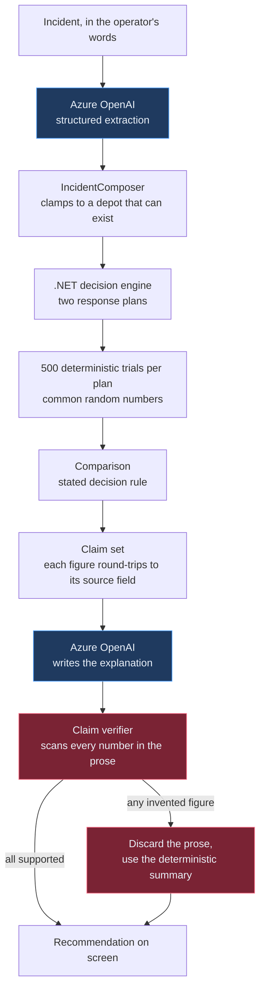

**The model may** read a report into a fixed schema · name and describe a plan · write the
executive explanation · classify which assumption a question is challenging.

**The model may not** produce a percentage, a cost or a vehicle count · decide which plan wins ·
state a figure no claim supports · be on the critical path.

Four mechanisms enforce that.

**Claims, not values.** Every displayed figure is a `Claim` carrying its source field
(`alternative.onTimeDeparturePct`), how it was calculated, the seed and the trial count. A claim
is `Verified` only if its value still round-trips through `ClaimSetBuilder.Resolve` to the
simulation output it names. Edit a value and verification fails.

**Rejection, not correction.** `ClaimVerifier` masks identifiers and clock times, then checks
every remaining number in the generated prose against the claim set and a short allow-list of
incident facts. One unsupported figure discards the *whole* paragraph — a narrative that got one
number wrong is not evidence about the others.

**Common random numbers.** Both plans are evaluated against the *same* sampled nights. The gap
between them reflects the plans, not sampling noise, so a plan cannot look better by accident.

**Reproducibility.** The generator is SplitMix64, implemented in-tree rather than taken from
`System.Random`, so anyone can regenerate the published figures from seed `20260728` on any
platform. A test pins a derived seed literally, to catch that ever changing.

Watch it work: the verification panel shows `8 verified claims · 0 unsupported numbers`. If a
model ever invents a figure, that panel shows the rejected token, its context, and the fact that
the deterministic summary was substituted.

### Try to fool it

A guarantee you have to take on trust is not much of a guarantee, so the app exposes the verifier
directly. Paste any paragraph into the **Try to fool it** panel — or `POST` it to
`/api/verification/probe` — and it reports a verdict on every number in it: which claim backs each
figure, or which incident fact does, or that nothing does.

```bash
curl -s -X POST http://localhost:5199/api/verification/probe \
  -H 'Content-Type: application/json' \
  -d '{"submitted":"Reprioritising lifts on-time departures to 97.2%, avoiding £4,200 of penalties."}' \
  | jq '{accepted, verdict, findings: [.findings[] | {token, supported, claimId}]}'
```

```
97.2   supported    claim alternative-on-time
4,200  unsupported  nothing produces this figure
→ rejected; the deterministic summary is shown instead
```

It is the same `ClaimVerifier` instance and the same claim set the product applies to its own
generated prose. There is no separate, friendlier check for visitors. Four worked examples ship
with it — one invented figure among true ones, an entirely invented paragraph, a plausible
rounding (`98%` when the run says `97.2%`), and an honest one that passes — and a test submits all
four and asserts each behaves as its label promises.

### The counterfactual canvas

One surface for the whole operation. Every tile is a real unit, shaded by how often it met its
requirement across the 500 runs; the strip above it is the actual resource inventory, with the
failed one struck through. Nothing on it is decoration.

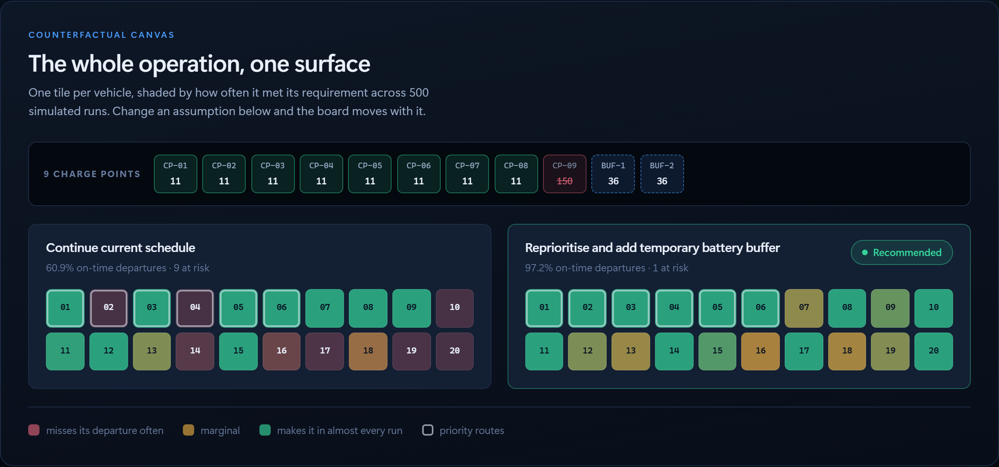

Run a counterfactual and the board moves with the numbers. Below, the towed battery arrives an hour
late — eight tiles on the recommended plan turn amber, its on-time figure falls from 97.2% to 86.7%,
and the do-nothing board is untouched because the lever never applied to it.

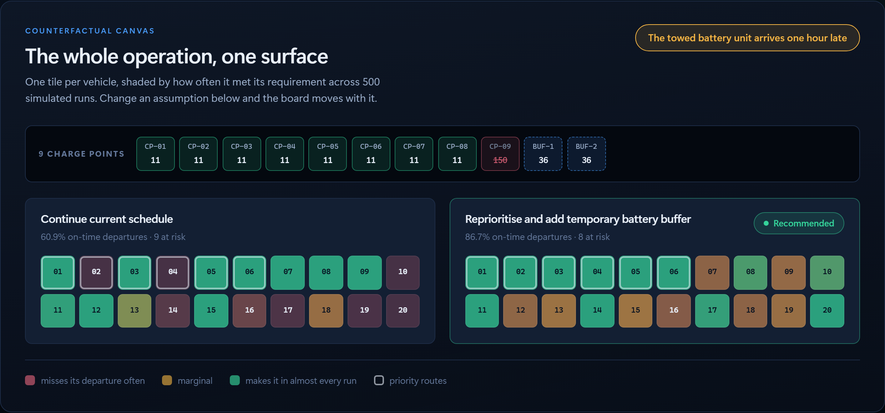

### Evidence-synced decision film

The canvas is for **exploring** a decision. The film is for **communicating** one. Both read the same
verified state.

> **Forkcast does not turn a model answer into a video. It turns a verified decision state into a
> video.**

Press **Play decision film** and the brief plays back as scenes, with an evidence rail that advances
with them: for the scene on screen, the claim ids it is permitted to show, their source fields, their
verified status, the seed and the trial count. A scene with no figure in it says so — *no numerical
claim required for this scene* — rather than borrowing one.

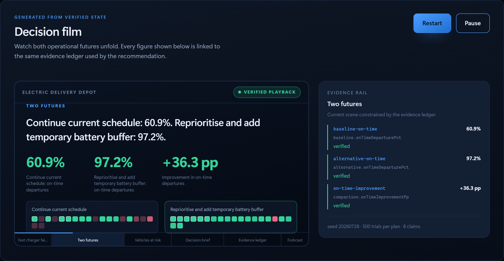

The player composes no figure of its own. It renders `beat.caption`, which the server built from
claim display values, and the claims named in `beat.claimIds`. Switch domain and the scenes re-word
themselves; run a counterfactual and the film marks itself stale — *decision state changed, film
regenerated from updated evidence* — then plays the new one.

```
Simulation → Claim set → Verified decision state → Counterfactual Canvas → Decision Film → MP4
```

### The decision brief, exported from verified state

`GET /api/briefing/export` returns the animated brief for whatever is currently on screen: timed
beats, the canvas state, and the claims each beat is allowed to show.

```bash
curl -s 'http://localhost:5199/api/briefing/export?scenario=compute&question=What+if+the+burst+capacity+comes+online+an+hour+late?'   | jq -r '.beats[] | "\(.startSeconds)s  \(.kind)  \(.caption)"'
```

```
0s    situation       24 jobs need 10 GPU nodes before 05:30. 2 of them just failed.
12s   futures         Hold the scheduled queue: 57.8%. Reprioritise and burst…: 85.6%.
38s   futures         14 under the baseline, 9 if you act.
54s   recommendation  Reprioritise regulated submissions and burst to the paired region.
72s   evidence        Every figure above traces to a simulation field, reproducible at seed 20260728.
92s   counterfactual  The burst capacity … arrives one hour late: on-time completions 94.7% to 85.6%…
112s  close           See both futures before you decide.
```

`npm run briefing:export -- --scenario compute` freezes that same payload to
`demo/generated/`, validating it first: every beat must reference only claims the payload carries,
the beats must tile the timeline with no gap, and the totals must agree. A renderer handed a broken
brief would produce a confident, wrong film, so the export refuses rather than writes.

Switch domain and the beats re-word themselves. Apply a counterfactual and a beat appears carrying
the real before-and-after. Every caption is composed from claim display values, incident facts and
the domain's vocabulary — and a test runs each caption back through the verifier, so the export
cannot introduce a figure the claim set does not carry. That test has already caught one:
an earlier evidence caption stated its own tally, which no claim backs.

---

## Running it

Requires the [.NET 9 SDK](https://dotnet.microsoft.com/download) and [Node.js 22+](https://nodejs.org).

```bash
# terminal 1 — API on http://localhost:5199
dotnet run --project src/Forkcast.Api

# terminal 2 — interface on http://localhost:5173
cd web && npm install && npm run dev
```

Open <http://localhost:5173>. **No credentials, no database, no other services.** The badge in
the header reads *Deterministic demo mode*, and everything works.

The API also serves an interactive reference at <http://localhost:5199/scalar/v1> and its OpenAPI
document at `/openapi/v1.json`.

### Verifying the build

```bash
dotnet build          # 0 warnings — warnings are errors
dotnet test           # 164 tests
cd web && npm run build
```

### Optional: connect Azure OpenAI

```bash
cp .env.example .env   # then fill in the three values
```

```
AZURE_OPENAI_ENDPOINT=https://<resource>.openai.azure.com
AZURE_OPENAI_API_KEY=<key>
AZURE_OPENAI_DEPLOYMENT=<deployment name>
```

The API reads `.env` at startup; real environment variables take precedence. Restart it and the
badge changes to *Azure OpenAI connected*. Every simulated number stays identical — what improves
is how unusual incident wording is read and how the explanation is written.

### API

| | |
|---|---|
| `GET /api/health` | Liveness, version, which provider is answering |
| `GET /api/demo/incident` | The preloaded incident and both response plans |
| `GET /api/demo/result` | The full decision at the published seed |
| `POST /api/incidents/parse` | Incident text → structured incident |
| `POST /api/simulations/run` | Simulate both plans, return the verified recommendation |
| `POST /api/simulations/challenge` | Change one assumption, rerun, report the difference |
| `POST /api/verification/probe` | Submit any paragraph to the claim verifier and get a verdict per number |
| `GET /api/scenarios` | The shipped domains |
| `GET /api/briefing/export` | The animated decision brief for the current verified state, claims included |

Every simulation endpoint takes an optional `scenario` of `"fleet"` or `"compute"`.

```bash
curl -s http://localhost:5199/api/demo/result | jq '.verification.verifiedClaims'

curl -s -X POST http://localhost:5199/api/simulations/challenge \
  -H 'Content-Type: application/json' \
  -d '{"question":"What happens if the temporary battery arrives one hour late?"}' \
  | jq -r '.delta.summary'
```

---

## Screenshots

**The incident**, editable, with its constraints read out of the text:

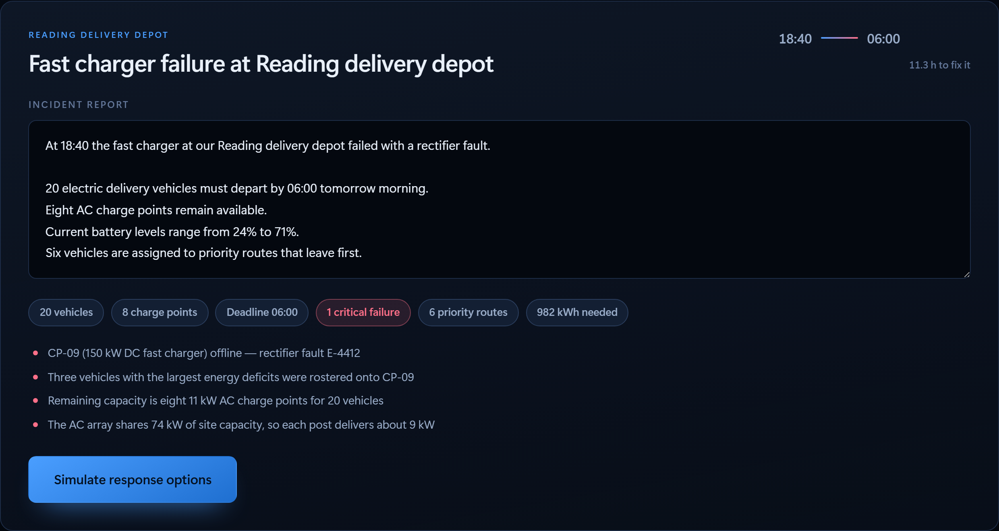

**Two futures**, drawn on one shared scale so the charts can be read against each other:

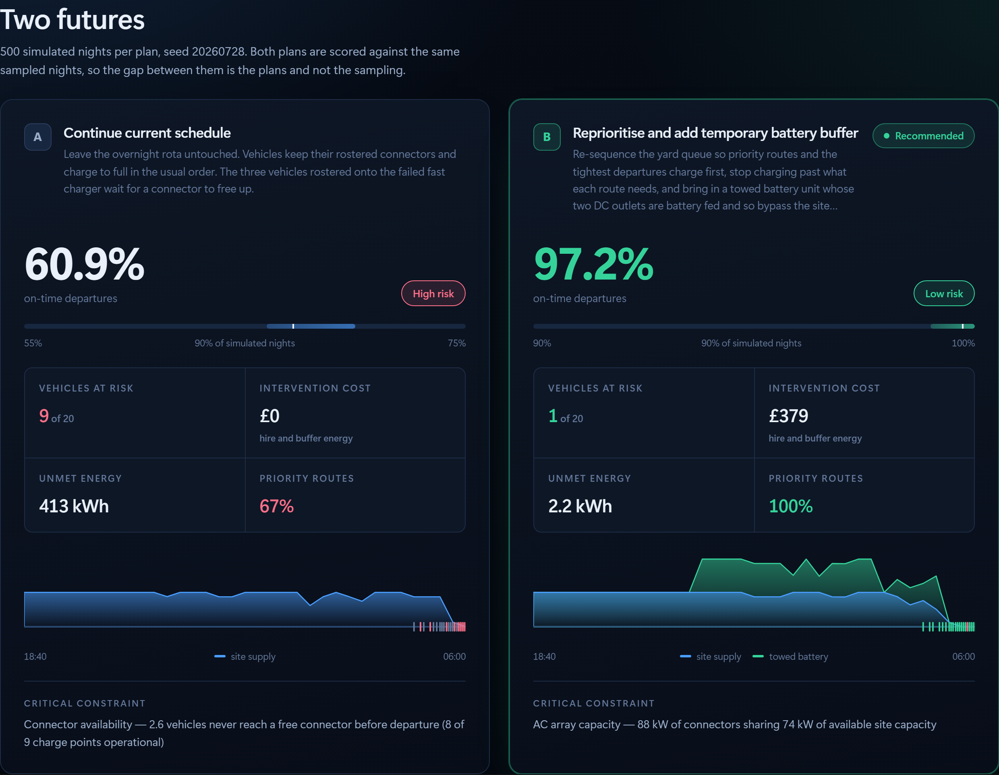

**The recommendation**, with the rule that chose it and the claims behind it:

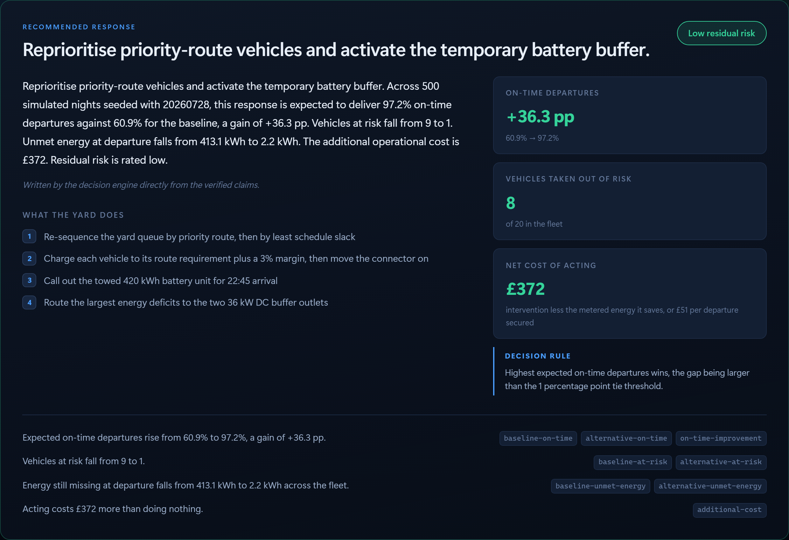

**Every number, accounted for** — expand any claim for its source field and calculation:

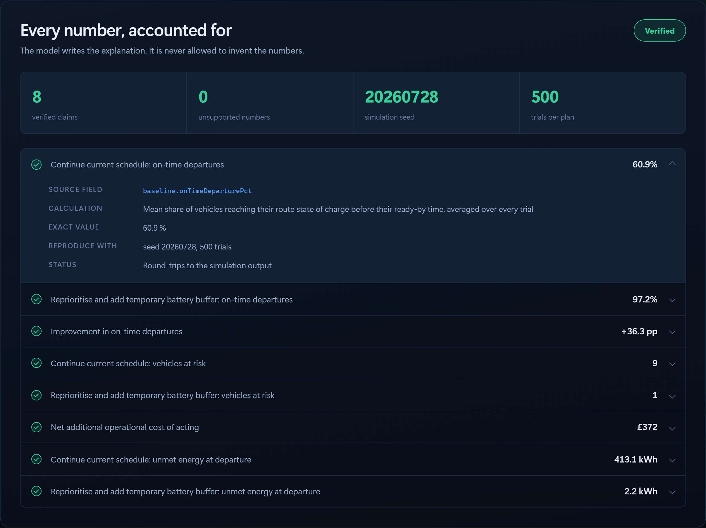

**Challenge it** — a real rerun, not a canned answer:

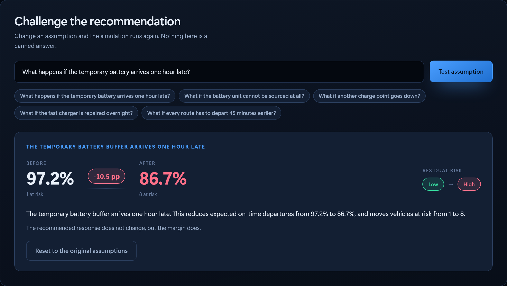

**Try to fool it** — every number in a submitted paragraph gets a verdict:

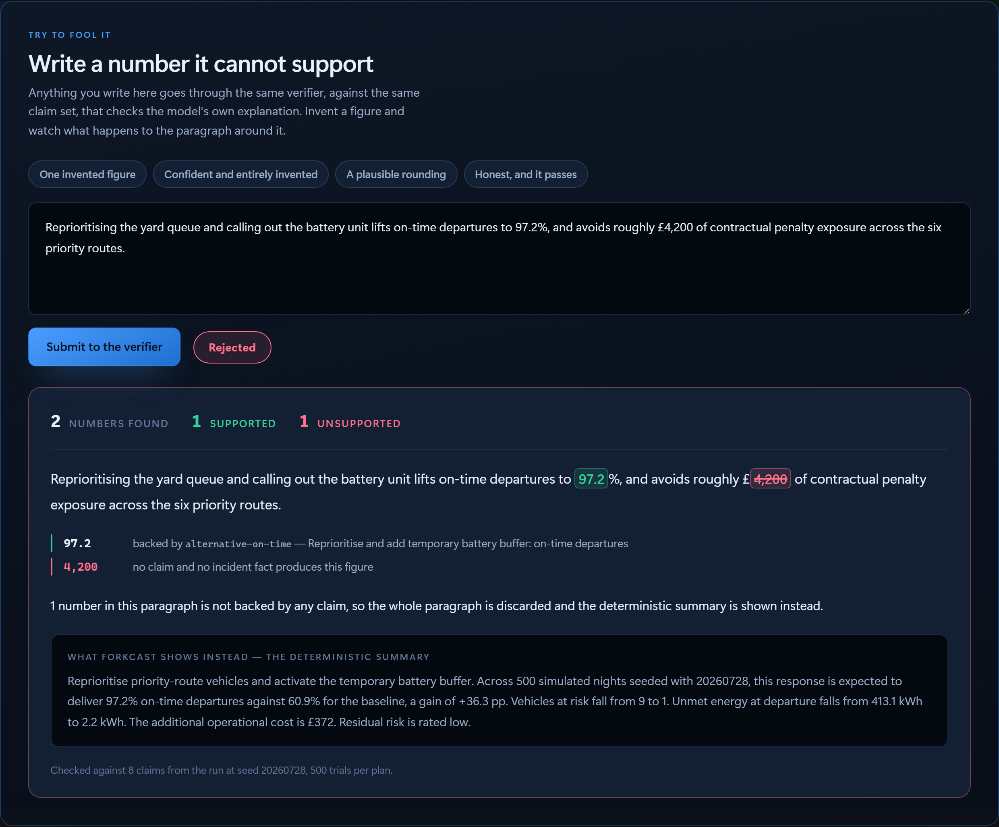

**Switch the domain** — the same engine, an unrelated incident:

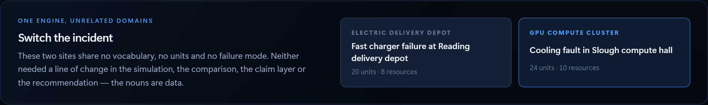

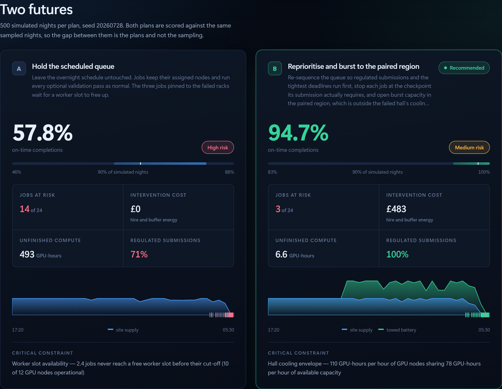

Every screenshot is captured from the running application by
[`web/scripts/capture.mjs`](web/scripts/capture.mjs). None of them is a mock-up.

## Demo video

**[`demo/demo-smooth.mp4`](demo/demo-smooth.mp4)** — 2:48, 1920×1080, H.264. This is the
submission cut. `demo/demo.mp4` is the earlier cut of the same film, kept for reference.

Built with [HyperFrames](https://hyperframes.heygen.com) from the same captured screens, so the
film shows the submitted application rather than a separate mock-up of it. Fifteen seconds in its
middle are an **uncut screen capture** — visible cursor, a real click on *Simulate*, the real
wait, the real numbers arriving, then a real click on *Test assumption* — recorded by
[`web/scripts/record-live.mjs`](web/scripts/record-live.mjs) driving the actual UI against the
actual API. Every figure spoken or
shown in it is one the engine returns at seed `20260728`, and the test
`Published_demo_figures_hold` fails if the engine ever stops returning them.

The whole composition is source, under [`videos/forkcast-launch/`](videos/forkcast-launch): the
brief, the storyboard, the narration script, and one HTML file per shot. Narration is a local
Kokoro voice; there is no music, so nothing in the video is licensed from anyone.

```bash
cd videos/forkcast-launch
npx hyperframes check     # 0 errors, 58/58 WCAG AA contrast checks
npx hyperframes render --quality high --output renders/video.mp4
```

---

## How it is built

```
src/
  Forkcast.Core/          pure domain — no framework, no I/O
    Simulation/           SplitMix64, trial noise, the engine
    Verification/         claims, the verifier, the allow-list
    Comparison/           the decision rule
    Challenges/           the closed set of challengeable assumptions
    Ai/                   the language boundary, and its deterministic implementation
  Forkcast.Api/           Minimal API, DTO mapping, Azure OpenAI provider
tests/Forkcast.Tests/     164 tests
web/                      React + TypeScript + Vite, one page
demo/                     screenshots and the demo video
```

`Forkcast.Core` has no dependency on ASP.NET, on HTTP, or on any model. It is the part that
computes, and it can be run and tested entirely on its own.

**No** database, authentication, repository pattern, CQRS, event bus, or microservices. The
problem does not need them, and each one would be another thing between a reviewer and the logic.

### Tests worth looking at

- `Published_demo_figures_hold` — pins the numbers in this README to what the engine returns, so
  the README and the video cannot drift away from the product
- `An_invented_number_is_rejected_and_the_narrative_is_replaced`
- `One_invented_number_discards_the_whole_narrative`
- `Clock_times_and_vehicle_identifiers_are_not_treated_as_quantities`
- `Derived_seeds_do_not_depend_on_runtime_string_hashing`
- `A_failing_language_model_does_not_take_the_decision_down`
- `Failed_and_remaining_connectors_are_told_apart`
- `The_critical_constraint_speaks_the_domain_language` — neither domain's constraint string
  contains the other's nouns
- `Published_compute_figures_hold_and_differ_from_the_fleet` — the second domain is not the first
  one relabelled
- `The_offered_examples_behave_as_their_labels_promise` — the verifier demonstration cannot start
  teaching the wrong lesson
- `The_analyser_and_the_rejection_list_agree` — the inspectable verdict and the enforced one are
  the same computation
- `Every_number_in_every_caption_survives_the_verifier` and
  `No_caption_carries_a_figure_the_verifier_would_reject` — the exported brief is held to the same
  rule as the model's prose, in both domains
- `A_beat_can_only_reference_a_claim_the_payload_carries` — the film cannot cite evidence it was
  never given

---

## Security and safety

- **No secrets in the repository.** `.env`, `appsettings.Development.json` and `secrets.json` are
  git-ignored; `.env.example` and `appsettings.Example.json` carry only empty placeholders. If a
  key is ever pushed by accident, rotate it in the Azure portal immediately — removing the commit
  is not enough.
- **The key never leaves the backend.** The browser talks only to the Forkcast API.
- **CORS is an allow-list** of the two local frontend ports. Never `AllowAnyOrigin`.
- **Input is bounded**: 4000 characters of incident text, 500 for a question, 1–2000 trials.
  Everything else is rejected with problem details.
- **No stack trace can reach the screen.** Unhandled failures are logged server-side and returned
  as a plain problem document; the frontend has a designed state for every failure, including the
  API being unreachable.
- **Model output is untrusted by construction.** Extraction is clamped by `IncidentComposer`,
  prose is checked by `ClaimVerifier`, challenge classification is constrained to a closed enum,
  and plan wording containing any digit is discarded.
- **No personal data.** The fleet is synthetic and fixed.

## Known limitations

Stated plainly, because a decision-support tool that oversells itself is the problem it claims to
solve.

- **The fleet model is simplified.** It models connector occupancy, static load management,
  re-plug delays and a towed battery. It does **not** model battery charge curves, thermal
  behaviour, cable losses, degradation or driver behaviour. It is a decision-support simulation,
  not a physical one.
- **The operational data is synthetic**, and deliberately so: the demo has to be reproducible from a
  published seed, auditable by a stranger, and free of anyone's private operational detail. The
  interface says so on the situation card. What a production integration would look like is written
  up in [`docs/operational-data-contract.md`](docs/operational-data-contract.md), with a worked
  snapshot per domain in [`docs/examples/`](docs/examples/) — **no connector is implemented**, and
  nothing in the running application reaches an external service.
- **It is not a fleet optimiser.** It compares two named strategies. It does not search for the
  best one.
- **Two plans, not N.** The comparison is deliberately head-to-head.
- **The deterministic reader is a fallback, not a peer.** Without Azure OpenAI, unusual phrasing
  may be misread. It reports what it could not find rather than guessing, and the interface shows
  those notes.
- **A real deployment would need integration** with fleet telematics, charge point management and
  the energy supplier, plus validation against measured outcomes before anyone trusted a number.
- **Human operators remain responsible.** Forkcast recommends. It does not act, and it is not
  designed to be believed without the evidence it shows alongside.
- **The domain types still carry the first domain's names.** `Vehicle` and `ChargePoint` are the
  internal type names in both domains; only the user-facing vocabulary is data. That is a
  deliberate trade to avoid a risky rename late in the build, and it is the next thing to fix.
- **Both scenarios price in pounds.** The currency is not yet part of the vocabulary.
- **The verifier checks numerals, not claims about causation.** A paragraph can pass the check and
  still be misleading in its wording; the guarantee is specifically about figures.

## Relation to FleetMind

FleetMind is the EV-fleet application context that motivated this work. Forkcast is the layer
underneath: a reusable engine that simulates, verifies and communicates operational decisions
across domains. One is an application; the other is the decision technology it would sit on.

That is why the compute hall matters more than it looks. It is not a second feature — it is the
evidence that the engine is not shaped like a depot.

## Prior work, and what is new here

Forkcast is informed by earlier work of mine on electric-fleet depot operations. The problem
framing, the demonstration scenario and the conviction that a language model must not be allowed
near the arithmetic all come from that experience rather than from nothing — and the brief this
repository was built from stated them up front.

What this implementation contributes:

- **Claim-level provenance.** Every displayed figure is a typed claim carrying its source field,
  its calculation method, its seed and its trial count, and it is only `Verified` if it still
  round-trips to the simulation output it names.
- **Rejection rather than correction.** Generated prose containing one unsupported figure is
  discarded whole, and the verifier is exposed for anyone to attack.
- **A domain-agnostic engine, demonstrated.** Two unrelated domains run on the same simulation,
  comparison, claim and recommendation code, with the vocabulary supplied as data.
- **Interactive assumption challenges.** A closed set of levers, each rerunning the simulation
  rather than generating prose about it.
- **A .NET and Azure implementation** with the language boundary off the critical path.

**On prior work.** No source code, UI assets or generated output from any previous project were
reused here. Everything in this repository was written during the event. The author has worked on
fleet and depot problems before, and that experience informed the choice of domain and what a
credible incident looks like — but the engine, the claim layer, the interface and the film were
all built from scratch for this hackathon. Third-party dependencies are the ones declared in
`Forkcast.*.csproj` and `web/package.json`, used as published.

## Where this goes next

The engine is generic over "constrained resource, hard deadline, competing responses". The fleet
scenario is one configuration of it. The same core would serve a factory line with a failed
machine and a shift deadline, a distribution centre with a dock shortage, a datacentre with a
cooling loop down and a thermal ceiling, or a rail depot with a maintenance road out of service.

What carries over unchanged: the claim layer, the verifier, common random numbers, the closed set
of challengeable assumptions, and the rule that the model explains but never calculates.

## Licence

[MIT](LICENSE).
